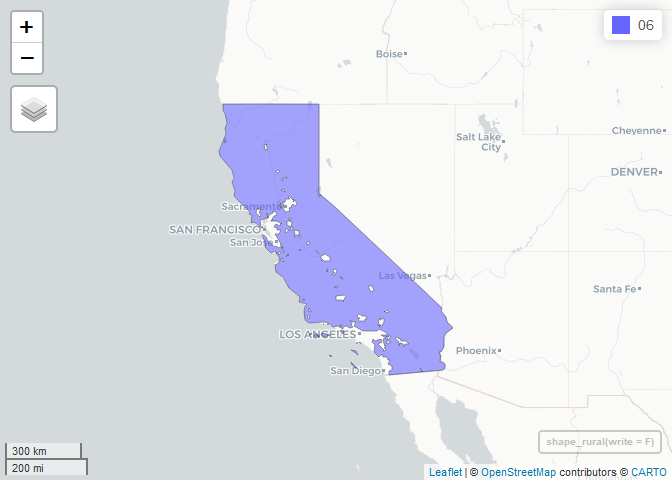
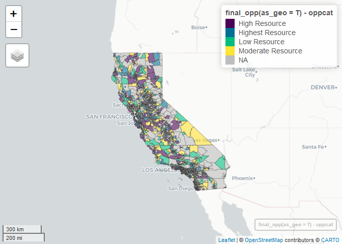

README
================
2023-08-08

## Fair Housing Map

In process documentation for CTCAC/HCD Opportunity and Neighborhood
Change Map package, temporarily called the “Fair Housing Map” until
further directed by CTCAC and HCD.

### Installation

1.  Clone repository

2.  Download data-raw directory and extract into root directory:
    <https://berkeley.app.box.com/folder/224592265510>

3.  Open package using “fairHousingMap.Rproj” file

4.  Load package and install dependencies:

``` r
devtools::install_dev_deps()
```

    ## 
    ## terra    (1.7-39 -> 1.7-46) [CRAN]
    ## classInt (0.4-9  -> 0.4-10) [CRAN]
    ## package 'terra' successfully unpacked and MD5 sums checked
    ## package 'classInt' successfully unpacked and MD5 sums checked
    ## 
    ## The downloaded binary packages are in
    ##  C:\Users\josephda\AppData\Local\Temp\RtmpQViORo\downloaded_packages

``` r
devtools::load_all()
```

### Census API

1.  Register for Census API key
    [here](https://api.census.gov/data/key_signup.html).

2.  Install the key in the tidycensus package. See
    `?tidycensus::census_api_key()` for details

3.  Build directory paths not included in repository:
    ‘data/intermediate/2024/’ and ‘output/2024/’

### Directory Structure

- *data* - .Rda files of census polygon geographies.

  - *intermediate* - intermediate data files.

- *analysis* - .Rmd files of internal reports, exploratory analysis,
  etc.

- *output* - Published datasets

- *README* - project root documentation

- *.gitignore* - instructions for git to ignore files

- *R* - R package functions, executes all code that goes into published
  tables and maps

- *map* - javascript webmaps

- *tests* - testthat tests to ensure package is working as expected

### TODO

- Develop testthat test suite.
- The legacy packages maptools, rgdal, and rgeos, underpinning the sp
  package, which is a dependency, will retire in October 2023. Replace
  functions that depend on sp with sf package equivalents.

### Sequence

Generating the final opportunity designations requires a series of
functions that must be called in a specific order.

**01_census_geography.R** contains functions for reading tract, block
group, and block population weighted centroids. No intermediate files
are written. The centroid-reading functions are called within other
subsequent scripts.

``` r
head(read_tract_centers())
```

    ## # A tibble: 6 × 4
    ##   fips        POPULATION   lat   lon
    ##   <chr>            <dbl> <dbl> <dbl>
    ## 1 06001400100       3038  37.9 -122.
    ## 2 06001400200       2001  37.8 -122.
    ## 3 06001400300       5504  37.8 -122.
    ## 4 06001400400       4112  37.8 -122.
    ## 5 06001400500       3644  37.8 -122.
    ## 6 06001400600       1788  37.8 -122.

**02_create_rural_shapefile.R** contains the shape_rural() function,
which imports the USDA shapefile for areas ineligible for rural
designation, then shrinks to only California data and subtracts them
from the complete California shapefile to get a rural areas shapefile.
This generates the first file, rural_shapefile.shp, which , which must
exist in the intermediate directory to proceed further.

``` r
shape_rural(write = F) # write = T will generate a new file
```

    ## Simple feature collection with 1 feature and 1 field
    ## Geometry type: MULTIPOLYGON
    ## Dimension:     XY
    ## Bounding box:  xmin: -124.4096 ymin: 32.53482 xmax: -114.1312 ymax: 42.00949
    ## Geodetic CRS:  WGS 84
    ## # A tibble: 1 × 2
    ##   fips_state                                                            geometry
    ## * <chr>                                                       <MULTIPOLYGON [°]>
    ## 1 06         (((-124.2171 41.95023, -124.2162 41.94989, -124.215 41.94973, -124…

``` r
# to map the shapefile
mapview::mapview(shape_rural(write = F))
```

<!-- -->

**03_create_region_designation.R** contains create_regions(), which
evaluates which regions that each county belongs to, then uses
rural_overlay() to pinpoint rural tracts. rural_overlay() merges block
centers with the rural_shapefile, and classifies the population of any
block with its centroid inside the rural shapefile as rural. It then
collapses to tract level, and any tract with over 50 percent population
rural is classified as “Rural Areas.” rural_overlay() is executed within
the create_regions() function, and is separated for testing convenience
only. For creating data, only create_regions() is necessary to run.

``` r
head(create_regions(read = T)) # reads the existing file, set to False to generate new
```

    ## # A tibble: 6 × 7
    ##   fips        county_name    region    rural_pct population rural_pop rural_flag
    ##   <chr>       <chr>          <chr>         <dbl>      <dbl>     <dbl>      <dbl>
    ## 1 06077003406 San Joaquin CA Central …     0           3769         0          0
    ## 2 06077004402 San Joaquin CA Central …     0           5599         0          0
    ## 3 06077004600 San Joaquin CA Rural Ar…     0.874       6099      5333          1
    ## 4 06077001400 San Joaquin CA Central …     0           5015         0          0
    ## 5 06077003106 San Joaquin CA Central …     0           3862         0          0
    ## 6 06077001700 San Joaquin CA Central …     0           4026         0          0

….

**08_final_data.R** contains final_raw() which loads and combines all
intermediate files with economic, education, and environmental
indicators. final_prepare() then creates the high poverty and segregated
designation and flags unreliable data. Finally, final_opp() creates the
final opportunity scores and designations. final_raw() and
final_prepare() are both inputs into the final_opp() function. Only
final_opp() is necessary to run for generating new data.

``` r
head(final_opp())
```

    ## # A tibble: 6 × 39
    ##   fips        fips_bg region   regionid county_name pct_above_200_pov home_value
    ##   <chr>       <chr>   <fct>    <chr>    <chr>                   <dbl>      <dbl>
    ## 1 06001400100 <NA>    Bay Are… Bay Are… Alameda                 0.891    1419200
    ## 2 06001400200 <NA>    Bay Are… Bay Are… Alameda                 0.913    1710400
    ## 3 06001400300 <NA>    Bay Are… Bay Are… Alameda                 0.892    1391300
    ## 4 06001400400 <NA>    Bay Are… Bay Are… Alameda                 0.854    1286700
    ## 5 06001400500 <NA>    Bay Are… Bay Are… Alameda                 0.733     958100
    ## 6 06001400600 <NA>    Bay Are… Bay Are… Alameda                 0.860    1012800
    ## # ℹ 32 more variables: pct_bachelors_plus <dbl>, pct_employed <dbl>,
    ## #   math_prof <dbl>, read_prof <dbl>, grad_rate <dbl>, pct_not_frpm <dbl>,
    ## #   env_site_pctl <dbl>, pct_above_200_pov_median <dbl>,
    ## #   home_value_median <dbl>, pct_bachelors_plus_median <dbl>,
    ## #   pct_employed_median <dbl>, math_prof_median <dbl>, read_prof_median <dbl>,
    ## #   grad_rate_median <dbl>, pct_not_frpm_median <dbl>, env_site_score <dbl>,
    ## #   pct_above_200_pov_score <dbl>, home_value_score <dbl>, …

``` r
# to map the output, use as_geo = T
mapview::mapview(final_opp(as_geo = T), zcol = 'oppcat')
```

<!-- -->
