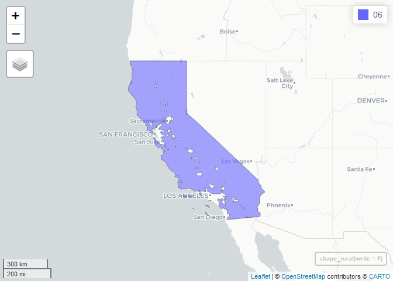
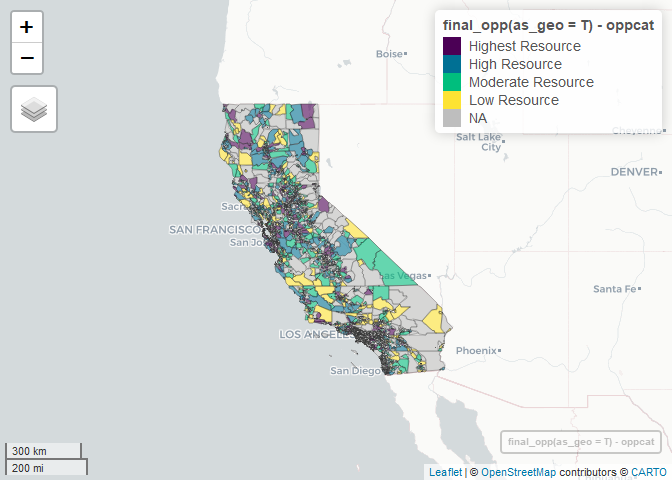

README
================
2023-08-08

## Fair Housing Map

In process documentation for CTCAC/HCD Opportunity and Neighborhood
Change Map package, temporarily called the “Fair Housing Map” until
directed further by CTCAC and HCD. Please see the [draft
methodology](https://docs.google.com/document/d/1_wk_B9l0ZVSAr6bSoVROc7xuwTteyJxc/edit?usp=sharing&ouid=106736372141423442162&rtpof=true&sd=true)
for details on the mapping approach.

### Installation

1.  Clone repository

2.  Download data-raw directory and extract into root directory:
    <https://berkeley.app.box.com/folder/224592265510>

3.  Open package using “fairHousingMap.Rproj” file

4.  Load package and install dependencies:

``` r
devtools::install_dev_deps()
```

    ## knitr (1.43 -> 1.44) [CRAN]
    ## 
    ##   There is a binary version available but the source version is later:
    ##       binary source needs_compilation
    ## knitr   1.43   1.44             FALSE
    ## 
    ## terra    (1.7-39 -> 1.7-46) [CRAN]
    ## classInt (0.4-9  -> 0.4-10) [CRAN]
    ## package 'terra' successfully unpacked and MD5 sums checked
    ## package 'classInt' successfully unpacked and MD5 sums checked
    ## 
    ## The downloaded binary packages are in
    ##  C:\Users\josephda\AppData\Local\Temp\RtmpimBVdq\downloaded_packages

``` r
devtools::load_all()
```

### Census API

1.  Register for Census API key
    [here](https://api.census.gov/data/key_signup.html).

2.  Install the key in the tidycensus package. See
    `?tidycensus::census_api_key()` for details

### Directory Structure

- *data* - .Rda files of census polygon geographies.

  - *intermediate* - intermediate data files.

- *analysis* - .Rmd files of internal reports, exploratory analysis,
  etc.

- *output* - Published datasets

- *README* - project root documentation

- *.gitignore* - instructions for git to ignore files

- *R* - R package functions, executes all code that goes into published
  tables and maps

- *map* - javascript webmaps

- *tests* - testthat tests to ensure package is working as expected

### TODO

- Develop testthat test suite (in progress as of 9/4/2023).
- The legacy packages maptools, rgdal, and rgeos, underpinning the sp
  package, which is a dependency, will retire in October 2023. Replace
  functions that depend on sp with sf package equivalents.

### Running the package

Generating the final opportunity designations requires calling a
sequence of functions in a specific order. Only functions which write
intermediate files are necessary to generate a new final output.

#### **01_census_geography.R**

Contains `read_tract_centers()`, `read_block_group_centers()`, and
`read_block_centers()`, functions for reading population weighted
centroids. The centroid-reading functions are called within other
subsequent scripts, and do not themselves produce any intermediate
files.

#### **02_create_rural_shapefile.R**

Contains `shape_rural()` , which imports the USDA shapefile for areas
ineligible for rural development housing programs, then shrinks to only
California data and subtracts them from the complete California
shapefile to get a rural areas shapefile.
`shape_rural(write = T)`generates the first necessary intermediate file,
rural_shapefile.shp, which must exist in the intermediate directory to
proceed.

``` r
shape_rural(write = F) # write = T will generate a new file
```

    ## Simple feature collection with 1 feature and 1 field
    ## Geometry type: MULTIPOLYGON
    ## Dimension:     XY
    ## Bounding box:  xmin: -124.4096 ymin: 32.53482 xmax: -114.1312 ymax: 42.00949
    ## Geodetic CRS:  WGS 84
    ## # A tibble: 1 × 2
    ##   fips_state                                                            geometry
    ## * <chr>                                                       <MULTIPOLYGON [°]>
    ## 1 06         (((-124.2171 41.95023, -124.2162 41.94989, -124.215 41.94973, -124…

``` r
mapview::mapview(shape_rural(write = F)) # to map the shapefile
```

<!-- -->

#### **03_create_region_designation.R**

Contains `create_regions()`, which evaluates which regions that each
county belongs to, then uses `rural_overlay()` to pinpoint rural tracts.
`rural_overlay()` merges block centers with the rural_shapefile, and
classifies the population of any block with its centroid inside the
rural shapefile as rural. It then collapses to tract level, and any
tract with over 50 percent population as rural is classified as “Rural
Areas.” `create_regions(write = T)` generates the required intermediate
file, tract_county_region.csv.

``` r
create_regions(read = T) # reads the existing file, set to False to generate new
```

    ## # A tibble: 9,129 × 7
    ##    fips        county_name    region   rural_pct population rural_pop rural_flag
    ##    <chr>       <chr>          <chr>        <dbl>      <dbl>     <dbl>      <dbl>
    ##  1 06077003406 San Joaquin CA Central…     0           3769         0          0
    ##  2 06077004402 San Joaquin CA Central…     0           5599         0          0
    ##  3 06077004600 San Joaquin CA Rural A…     0.874       6099      5333          1
    ##  4 06077001400 San Joaquin CA Central…     0           5015         0          0
    ##  5 06077003106 San Joaquin CA Central…     0           3862         0          0
    ##  6 06077001700 San Joaquin CA Central…     0           4026         0          0
    ##  7 06077000401 San Joaquin CA Central…     0           3351         0          0
    ##  8 06077003404 San Joaquin CA Central…     0           5849         0          0
    ##  9 06001450200 Alameda CA     Bay Are…     0           6456         0          0
    ## 10 06001444100 Alameda CA     Bay Are…     0           7703         0          0
    ## # ℹ 9,119 more rows

#### 04_census_data.R

Contains `all_census_data`() which downloads all relevant decennial and
ACS data from Census API using tidycensus, then derives percentages and
calculates margins of error for derived variables. Both
`all_census_data(geo = 'tract', write = T)` and
`all_census_data(geo = 'bg', write = T)` are necessary to generate
intermediate tract- and block group-level data.

``` r
all_census_data(geo = 'tract', read = T, write = F) # for tracts
```

    ## # A tibble: 9,129 × 78
    ##    fips        countyid total_pop_2020 pct_prisoner_2020 county_name
    ##    <chr>       <chr>             <dbl>             <dbl> <chr>      
    ##  1 06001400100 06001              3038                 0 Alameda    
    ##  2 06001400200 06001              2001                 0 Alameda    
    ##  3 06001400300 06001              5504                 0 Alameda    
    ##  4 06001400400 06001              4112                 0 Alameda    
    ##  5 06001400500 06001              3644                 0 Alameda    
    ##  6 06001400600 06001              1788                 0 Alameda    
    ##  7 06001400700 06001              4508                 0 Alameda    
    ##  8 06001400800 06001              3917                 0 Alameda    
    ##  9 06001400900 06001              2514                 0 Alameda    
    ## 10 06001401000 06001              6097                 0 Alameda    
    ## # ℹ 9,119 more rows
    ## # ℹ 73 more variables: employment_pop_2021 <dbl>,
    ## #   moe_employment_pop_2021 <dbl>, employed_2021 <dbl>,
    ## #   pct_employed_2021 <dbl>, total_pop_2021 <dbl>, white_2021 <dbl>,
    ## #   black_2021 <dbl>, amer_indian_2021 <dbl>, asian_2021 <dbl>,
    ## #   hawaiian_2021 <dbl>, other_race_2021 <dbl>, two_races_2021 <dbl>,
    ## #   hispanic_2021 <dbl>, moe_total_pop_2021 <dbl>, moe_white_2021 <dbl>, …

``` r
all_census_data(geo = 'bg', read = T, write = F) # for block groups
```

    ## # A tibble: 25,607 × 79
    ##    fips        countyid total_pop_2020 pct_prisoner_2020 fips_bg     county_name
    ##    <chr>       <chr>             <dbl>             <dbl> <chr>       <chr>      
    ##  1 06001400100 06001              1789                 0 0600140010… Alameda    
    ##  2 06001400100 06001              1249                 0 0600140010… Alameda    
    ##  3 06001400200 06001               979                 0 0600140020… Alameda    
    ##  4 06001400200 06001              1022                 0 0600140020… Alameda    
    ##  5 06001400300 06001              1390                 0 0600140030… Alameda    
    ##  6 06001400300 06001              1123                 0 0600140030… Alameda    
    ##  7 06001400300 06001              1528                 0 0600140030… Alameda    
    ##  8 06001400300 06001              1463                 0 0600140030… Alameda    
    ##  9 06001400400 06001              1558                 0 0600140040… Alameda    
    ## 10 06001400400 06001              1353                 0 0600140040… Alameda    
    ## # ℹ 25,597 more rows
    ## # ℹ 73 more variables: employment_pop_2021 <dbl>,
    ## #   moe_employment_pop_2021 <dbl>, employed_2021 <dbl>,
    ## #   pct_employed_2021 <dbl>, total_pop_2021 <dbl>, white_2021 <dbl>,
    ## #   black_2021 <dbl>, amer_indian_2021 <dbl>, asian_2021 <dbl>,
    ## #   hawaiian_2021 <dbl>, other_race_2021 <dbl>, two_races_2021 <dbl>,
    ## #   hispanic_2021 <dbl>, moe_total_pop_2021 <dbl>, moe_white_2021 <dbl>, …

#### 05_education_data.R

Contains `read_educ_pov()` which imports relevant math/reading scores
and share of students receiving free or reduced priced meals (frpm).
`read_educ_pov()` is called in subsequent scripts and does not produce
any intermediate files. Reading/math data is weighted by total
enrollment of schools that return 4th-grade test scores. FRPM data is
limited to and weighted by enrollment in schools that serve elementary
school students. `graduation_rates()` imports and writes cohort-weighted
high school graduate rates to the intermediate directory.

``` r
graduation_rates(write = F) # set to True to generate new data
```

    ## # A tibble: 1,638 × 8
    ##    CDSCode    grad_rate county_name hs_drop_rate enrollment countyid   lon   lat
    ##    <chr>          <dbl> <chr>              <dbl>      <dbl> <chr>    <dbl> <dbl>
    ##  1 011001701…     0.928 Alameda            0.06          83 06001    -122.  37.8
    ##  2 011001701…     0.966 Alameda            0.034         29 06001    -122.  37.6
    ##  3 013161701…     0.483 Alameda            0.034         29 06001    -122.  37.6
    ##  4 016111901…     1     Alameda            0             39 06001    -122.  37.8
    ##  5 016111901…     0.918 Alameda            0.02          49 06001    -122.  37.8
    ##  6 016111901…     0.956 Alameda            0.009        454 06001    -122.  37.8
    ##  7 016111901…     0.895 Alameda            0.079         38 06001    -122.  37.8
    ##  8 016111901…     0.958 Alameda            0.021        236 06001    -122.  37.8
    ##  9 016112701…     0.916 Alameda            0.061        310 06001    -122.  37.9
    ## 10 016114301…     0.881 Alameda            0.103        848 06001    -122.  37.9
    ## # ℹ 1,628 more rows

#### 06_education_distance.R

Contains `school_distances()` which finds school distance to tract or
block group centroids, and averages the reading and math scores, frpm,
and graduation rates of the three nearest schools.

``` r
school_distances(read = T, write = F) # set read to False, write to True to generate new data
```

    ## # A tibble: 9,129 × 9
    ##    fips        pct_frpm read_prof math_prof grad_rate distance_elem_avg
    ##    <chr>          <dbl>     <dbl>     <dbl>     <dbl>             <dbl>
    ##  1 06001400100    0.300     0.742     0.687     0.913             0.972
    ##  2 06001400200    0.281     0.718     0.613     0.902             0.517
    ##  3 06001400300    0.530     0.476     0.383     0.939             0.593
    ##  4 06001400400    0.375     0.589     0.500     0.902             0.404
    ##  5 06001400500    0.372     0.574     0.462     0.939             0.330
    ##  6 06001400600    0.530     0.476     0.383     0.939             0.526
    ##  7 06001400700    0.615     0.393     0.266     0.939             0.622
    ##  8 06001400800    0.492     0.571     0.520     0.887             0.278
    ##  9 06001400900    0.663     0.319     0.160     0.917             0.387
    ## 10 06001401000    0.795     0.305     0.150     0.939             0.491
    ## # ℹ 9,119 more rows
    ## # ℹ 3 more variables: distance_elem_closest <dbl>,
    ## #   distance_elem_farthest <dbl>, pct_not_frpm <dbl>

#### 07_enviroscreen.R

Contains `xwalk_ces()` which imports CalEnviroScreen 4.0 site-based
measurements (cleanup sites, hazardous waste, groundwater threats, solid
waste) from the final 2023 TCAC file, creates a binary score for tracts
in the bottom 5% of site-based hazards within regions, then crosswalks
to 2020 tracts using an overlay method of \>= 5% of intersecting land
area.

``` r
xwalk_ces(read = T, write = F)
```

    ## # A tibble: 9,107 × 8
    ##    fips        cleanup_sites hazard_waste groundwater solid_waste env_site_mean
    ##    <chr>               <dbl>        <dbl>       <dbl>       <dbl>         <dbl>
    ##  1 06001400100         0.681        0.885       0.466       0.727         0.690
    ##  2 06001400200         0            0.273       0.825       0             0.275
    ##  3 06001400300         0.397        0.677       0.794       0             0.467
    ##  4 06001400400         0            0.483       0.889       0             0.343
    ##  5 06001400500         0.541        0.513       0.782       0             0.459
    ##  6 06001400600         0.458        0.533       0.727       0             0.430
    ##  7 06001400700         0.715        0.667       0.880       0             0.566
    ##  8 06001400800         0.95         0.942       0.969       0             0.715
    ##  9 06001400900         0.868        0.797       0.954       0             0.655
    ## 10 06001401000         0.899        0.8         0.978       0             0.669
    ## # ℹ 9,097 more rows
    ## # ℹ 2 more variables: env_site_pctl <dbl>, env_site_score <dbl>

#### 08_neighborhood_change.R

Contains `read_neighborhood_change()` which imports neighborhood change
data generated by CHPC. CHPC’s scripts are located in
R/neighborhood_change/ and identify tracts that have experienced both
long-term (since 2000) and recent (since 2013) racial/ethnic and
economic change. `read_neighborhood_change()` is called in the
subsequent script.

#### 09_final_data.R

Contains `final_opp()` which loads and combines all intermediate files
of economic, education, and environmental indicators, creates the final
opportunity scores and designations. `read_neighborhood_change()` is
called and joined to the final data frame.

``` r
final_opp()
```

    ## # A tibble: 11,347 × 51
    ##    fips        fips_bg region  regionid county_name pct_above_200_pov home_value
    ##    <chr>       <chr>   <fct>   <chr>    <chr>                   <dbl>      <dbl>
    ##  1 06001400100 <NA>    Bay Ar… Bay Are… Alameda                 0.891    1419200
    ##  2 06001400200 <NA>    Bay Ar… Bay Are… Alameda                 0.913    1710400
    ##  3 06001400300 <NA>    Bay Ar… Bay Are… Alameda                 0.892    1391300
    ##  4 06001400400 <NA>    Bay Ar… Bay Are… Alameda                 0.854    1286700
    ##  5 06001400500 <NA>    Bay Ar… Bay Are… Alameda                 0.733     958100
    ##  6 06001400600 <NA>    Bay Ar… Bay Are… Alameda                 0.860    1012800
    ##  7 06001400700 <NA>    Bay Ar… Bay Are… Alameda                 0.729     836400
    ##  8 06001400800 <NA>    Bay Ar… Bay Are… Alameda                 0.748     777900
    ##  9 06001400900 <NA>    Bay Ar… Bay Are… Alameda                 0.772     898600
    ## 10 06001401000 <NA>    Bay Ar… Bay Are… Alameda                 0.883     780400
    ## # ℹ 11,337 more rows
    ## # ℹ 44 more variables: pct_bachelors_plus <dbl>, pct_employed <dbl>,
    ## #   math_prof <dbl>, read_prof <dbl>, grad_rate <dbl>, pct_not_frpm <dbl>,
    ## #   env_site_pctl <dbl>, pct_above_200_pov_median <dbl>,
    ## #   home_value_median <dbl>, pct_bachelors_plus_median <dbl>,
    ## #   pct_employed_median <dbl>, math_prof_median <dbl>, read_prof_median <dbl>,
    ## #   grad_rate_median <dbl>, pct_not_frpm_median <dbl>, env_site_score <dbl>, …

``` r
mapview::mapview(final_opp(as_geo = T), zcol = 'oppcat') # to map the output
```

<!-- -->
